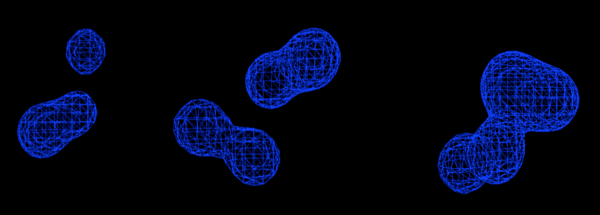

# Metaballs

Implements the the [Marching Cubes](http://paulbourke.net/geometry/polygonise/) algorithm to generates triangle meshes that approximates isosurfaces of balls in a box. 

Note: Requires Eigen 3.2.4 and assumes it is in /usr/local/Cellar/eigen/3.2.4/include/eigen3/
